# Coding Website

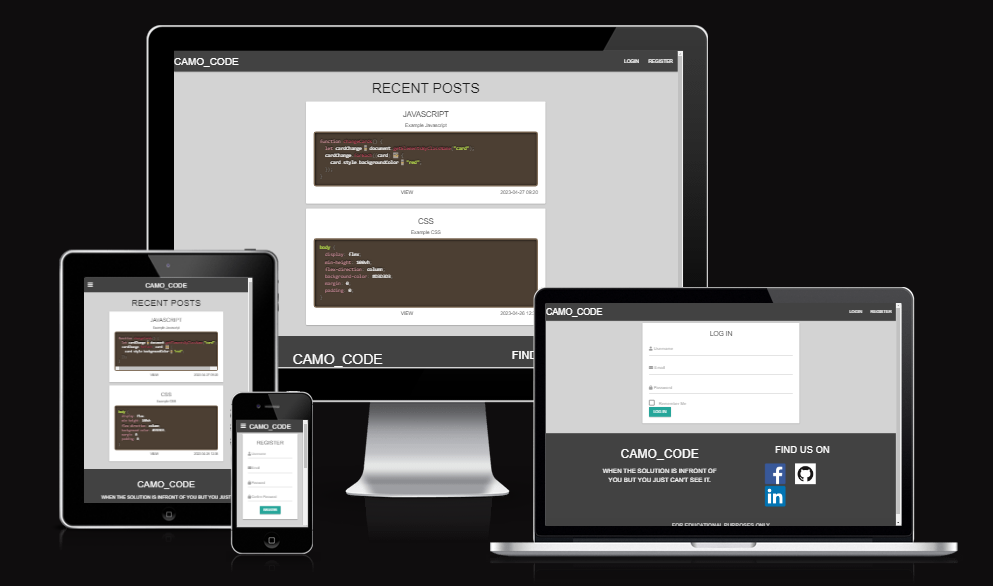

[View the live site here](https://camocode.herokuapp.com/)

A social media website for developers that allows people to create simple text posts as well as share code, or ask for help!

## Table of Contents

- [**Project Goals**](#project-goals)
- [**User Experience UX**](#user-experience-ux)
- [**Wireframes**](#wireframes)
- [**Features**](#features)
- [**Technologies**](#technologies)
- [**Testing**](#testing)
- [**Installation / Deployment**](#Installation / Deployment)
- [**Credits**](#credits)
- [**Acknowledgements**](#acknowledgements)

## Project Goals

The main aim is to give users a platform to post code snippets and get help/feedback from other users.

The target audience is developers or anyone who enjoys coding.

### User goals

* Enjoyable experiance on the site.
* To be able to create an account.
* To be able to customize my account.
* To be able to create posts.
* To be able to edit posts.
* To be able to view posts.
* To be able to delete posts.
* To be able to comment on posts.
* To be able to view list of comments.

### Developer goals

* Create a clean responsive interactive website for milestone project.
* An easy to navigate site.
* A project that would be good enough to go in a portfolio.
* To offer a social media network specifically designed for developers.
* To allow users to create posts or comment on posts, both of which provide an option to include code content.
* To allow users to view posts or assist others with comments.
* To allow users to edit their own posts.
* To allow users to delete their own posts.

## User Experience - UX

### Scope

#### Potential/Existing User Stories

* I want to know the site's purpose from the first page.
* I want to be able to register for a new account.
* I want to be able to log in to my newly created account.
* I want to be able to view my profile.
* I want to be able to view my posts.
* I want to be able to view other people's posts.
* I want to be able to create a new posts.
* I want to be able to edit my posts.
* I want to be able to delete my posts.
* I want to be able to create new comments/reply to posts.
* I want to be able to view all comments on a post.
* I want to be able to edit my account.
* I want to be able to delete my account.

#### Site Owner User Stories

* I want potential users to know from the start what the site's purpose is.
* I want potential users to be able to register for an account.
* I want existing users to be able to be able to login.
* I want logged in users to be able to create new posts.
* I want logged in users to be able to view other people's posts.
* I want logged in users to be able to edit their posts.
* I want logged in users to be able to delete their own posts.
* I want logged in users to be able to add comments.
* I want logged in users to be able to view other people's as well as their own comments.
* I want logged in users to be able to edit profile info.

### Design Choices

#### Fonts

* The fonts used were taken from [Google Fonts](https://fonts.google.com/)
* The fonts Roboto and Lato were used because they are popular and therefore more recognisable.
* The font sans-serif was put in as a back up.

#### Icons

* Icons used were taken from [Font awesome](https://fontawesome.com/)
* All icons used were chosen because they are easily recognisable to clients.

#### Colours

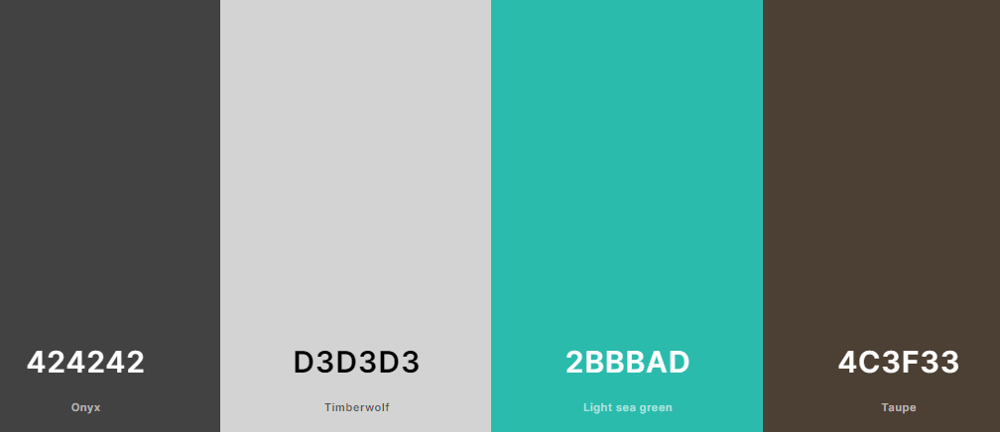

* The primary colour choices of onyx and timberwolf were chosen for the navbar and background because they have a clean clear aspect while contrasting well with each other.
* Taupe was used for the code block background and light sea green for buttons.
* Black, grey and white were chosen to make the writing stand out against the background.

#### Styling

* I have used Materialize throughout the site primarily to assist with design and responsiveness and added my own custom styling.
* PrismJS was used to provide styling and colour for the code area.

#### Images

* The only images I used were for the social media links, credited in the credits section.

## Wireframes

Wireframes for the project were developed after the idea was scribbled on a piece of paper, the program used being Figma.

### Desktop Wireframe

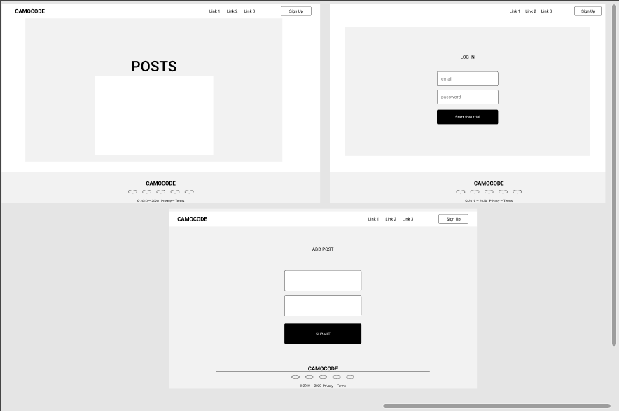

### Mobile Wireframe

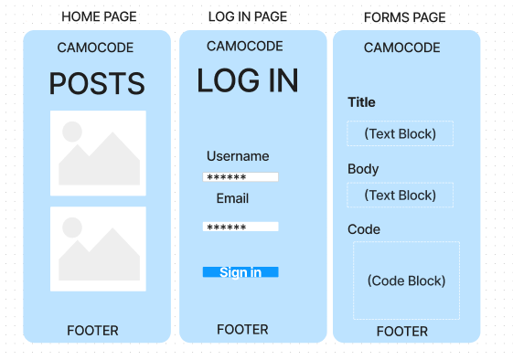

## Features

The coding website is designed to strictly adhere to accessibility guidelines across all pages, with easy navigation between them. Device responsiveness approach taken throughout project.

### Front-End Structure

#### Navbar and Footer

* The navbr and footer were taken from materialize and styled to suit needs. The same navbar and footer used on every page for easy navigation. Added social media links to the footer.

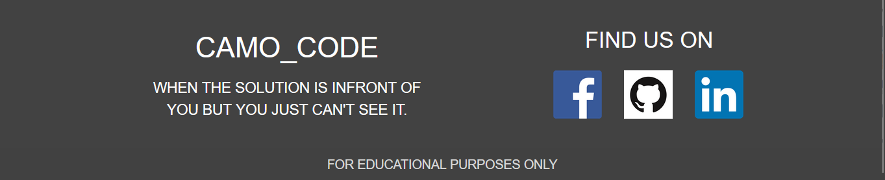

The website is split into 9 pages, stored in 12 html files. 

1. Home - home.html
- Landing page, and first page user encounters when they visit the website, includes a list of the most recent posts.

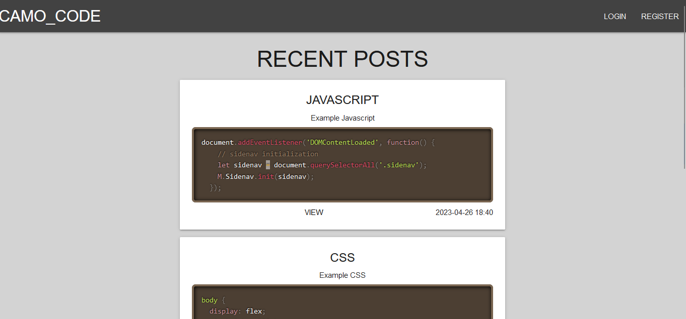

2. Register - register.html
- The user is able to register an account to the website.

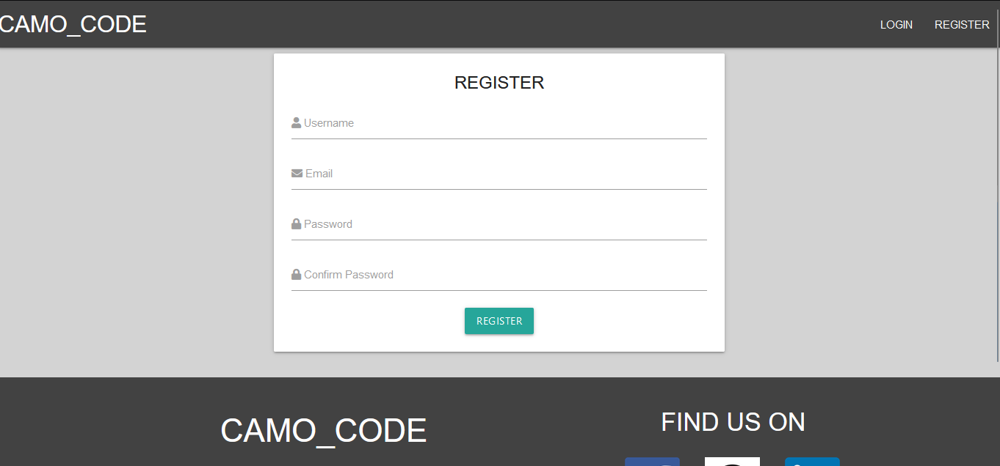

3. Log In - login.html
- The user is able to log in to the website using an existing account, otherwise they are invited to create a new one. Once logged in they are redirected to the home page.

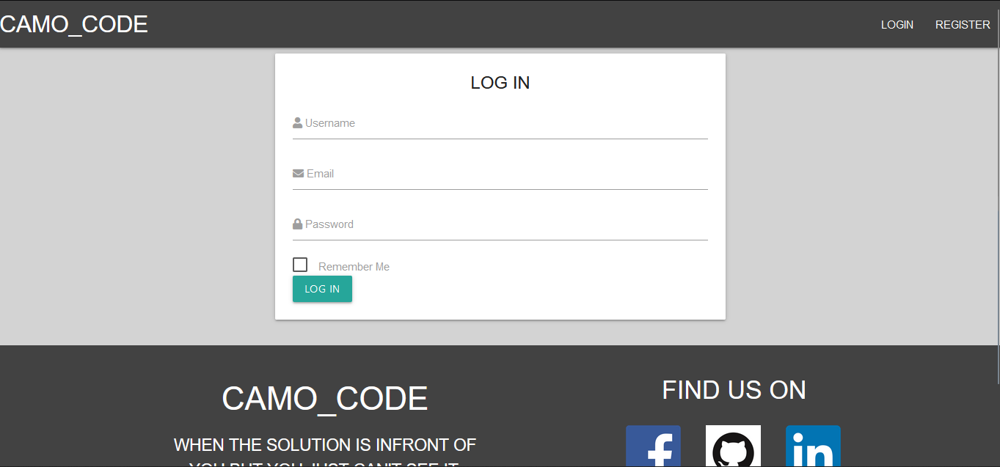

4. Profile - profile.html
- Available only to the user logged in via which they can view their account info, provides links via which user can change their profile info, and logout or delete their account.

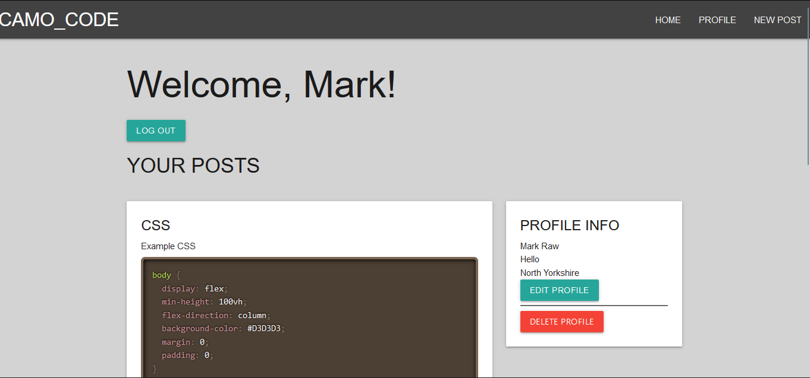

5. Update Profile - update_profile.html 
- Available only to the user logged in, allows user to change edit their account details.

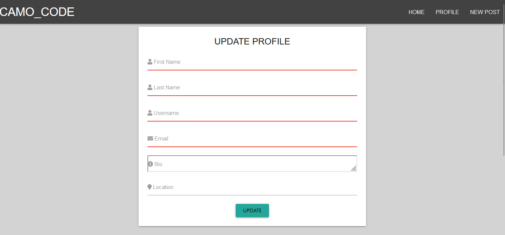

6. New Post - new_post.html
- Providers a form which users can populate to create a new post. In addition to the standard text input fields, this also contains a dropdown box which the user can select the type of language to post code into the code window.

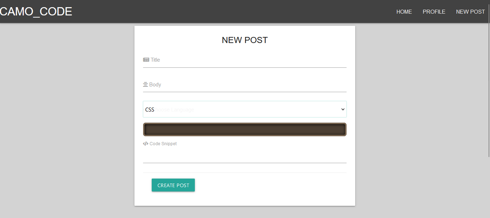

7. Post - post.html 
- View of a single post and it's comments. If the current user is the owner of the post then a edit and delete button appear under the post.

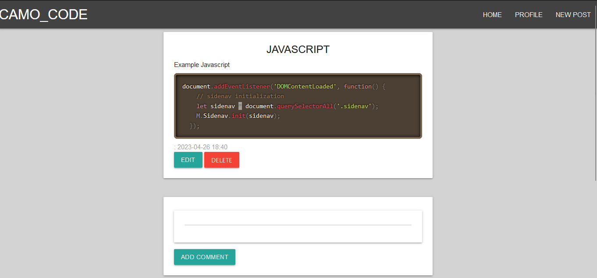

8. Update Post - update_post.html
- Utilizes similar code to the New Post page, but instead the form presented is populated with the post's current content that can be changed and reposted.

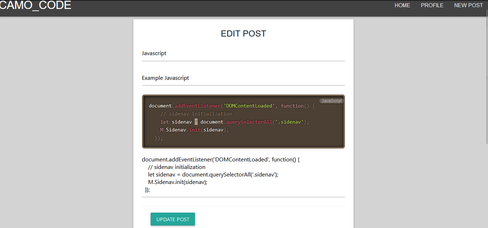

9. Comment - comment.html
- Utilizes similar code to the New Post page, but instead the form presented is populated with the a body element and a dropdownbox if the user wants to add a code snippet with there comment.

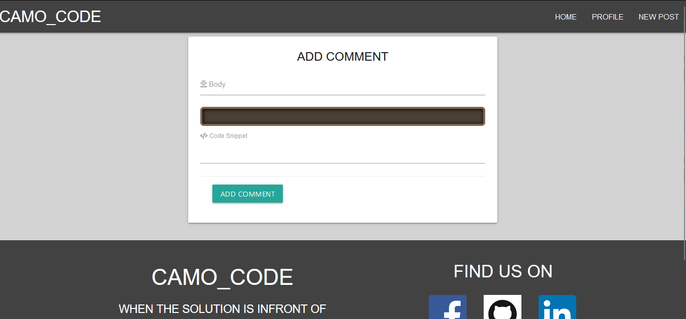

### Back-End Structure

#### Physical Database Model

Below model displays all fields stored in the database collection as well as the relationships with each collection.

There are 5 collections:
- Users - stores User profile data.
- Posts - stores Posts data.
- Comments - stores Comments and Subcomments data.
- Profile - store profile data.
- Registration - stores registration data.

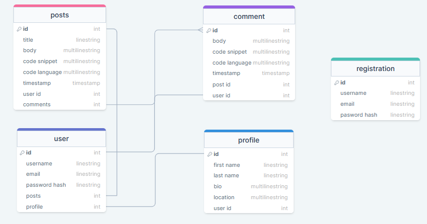

* Built with Flask using Postgresql for the database.
The application structure is as follows:
* routes.py - contains all routes for the website.
* models.py - contains all schemas for the website.
* init.py - contains all database info for the website.
* env.py - contains secret password and other info for the website.
* forms.py - contains all forms for the website.
* templates - contains all .html files for the website.
* static - contains all css, js and images for the website.
* Application is created and setup by running app.py.

Additional gadgets used in back-end:

* Flask login - For all login/logout capabilities.
* Flask wtf/wtforms - For all form functions.
* werkzeug.security - For password checks.
* datetime - For date and time stamps.
* UglifyJS - For JS files minificatin and compression.

## Technologies

### Languages

This project was built using [HTML5](https://en.wikipedia.org/wiki/HTML5),[CSS3](https://en.wikipedia.org/wiki/CSS) and [JS](https://www.javascript.com/) using a link from [Python](https://www.python.org/).

### Frameworks

Here is a list of the following technologies used in this project:

- [HTML5](https://en.wikipedia.org/wiki/HTML5)
HTML 5 was used to create the structure of the website.
- [CSS3](https://en.wikipedia.org/wiki/CSS)
CSS 3 was used to style the website.
- [JS](https://www.javascript.com/)
JS was used to give interactivity.
- [Python](https://www.python.org/)
Python was used for its database mechanics.
- [SQLAlchemy](https://www.sqlalchemy.org/)
 SQLAlchemy was used for its database mechanics.
- [GitHub](https://github.com/)
GitHub was used to store the projects code.
- [Gitpod](https://gitpod.io/)
Gitpod terminal was used to commit my code using Git and push it to Github.
- [Materialize](https://materializecss.com/)
Materialize was used for its easy design and responsiveness.
- [PrismJS](https://prismjs.com/)
PrismJS was used for its code highlighting and autoloader features.
- [Figma](https://www.figma.com/templates/wireframe-kits/)
Figma was used to design the wireframes for the project.
- [Am I Responsive](https://ui.dev/amiresponsive)
Am I responsive was used to ensure the website is responsive on all devices.
- [W3C Validation](https://validator.w3.org/)
W3C Validation was uesd for checking HTML and CSS for mistakes.
- [ES6 Validator](https://www.piliapp.com/syntax-check/es6/)
W3C Validation was uesd for checking JS files for mistakes.
- [pycodestyle Validator](https://pypi.org/project/pycodestyle/)
W3C Validation was uesd for checking Python files for mistakes.

## Testing

### Browsers

Developer tools on Firefox and Google Chrome were used throughout the project.
The website was tested on three different browsers with no problems:

* Microsoft Edge
* Google Chrome
* Mozila Firefox

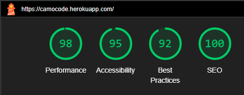

### Mobile

Developer tools on Firefox and Google Chrome were used throughout the project to check site responsiveness.
Checked the website on my own mobile and other family members with no problems:

* Iphone
* Samsung Galaxy
* Dev Tools Mobile Responsiveness

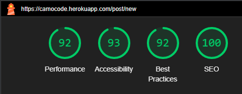

### HTML Validator

HTML Validator using [W3C Validation](https://validator.w3.org/) confirms no errors or warnings.

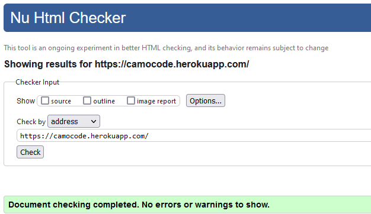

### CSS Validator

CSS Validator using [W3C Validation](https://jigsaw.w3.org/css-validator/) with the only error bieng from an imported materialize file that I dont have access to.

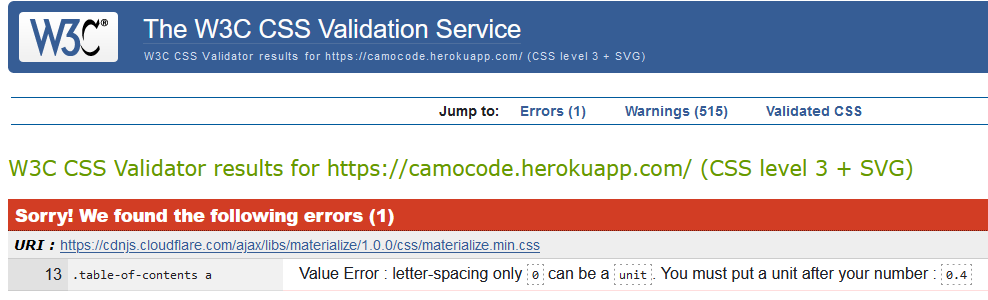

### JS Validator

JS Validator using [ES6 Syntax Check](https://www.piliapp.com/syntax-check/es6/) confirms no errors found.

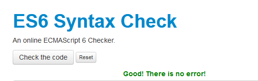

### Python Validator

Python Validator using [pycodestyle Syntax Check](https://pypi.org/project/pycodestyle/) was used to validate Python code for PEP8 compliance.

### Manual Testing

* Landing/Home Page - Due to the nature and structure of the website, the user can tell immediately what the goal of the site is - As expected.
* Log In Page - User clicks on Log In button in the navbar which takes them to the sign up page where they can create an account - As expected.
* Register Page - User clicks on Register button in the navbar which takes them to the registration page where they can create a profile - As expected.
* Profile Page - User clicks on Profile button in the navbar which takes them to the profile page where they can edit, delete and log out - As expected.
* Home Page - User clicks on Home button in the navbar which takes them to the home page where they can see a list of most recent posts - As expected.
* New Post Page - User clicks on New Post button in the navbar which takes them to the new post page where they can create a post - As expected.
* Post Page - User clicks on view button on the post which takes them to the post page where if they are the post creater they can edit and delete or any user can make a comment on the post - As expected.
* Update Post Page - User clicks on edit post button in post page which takes them to the update post form prepopulated with the post data where they can edit there post - As expected.
* Comment Page - User clicks on Comment button in the post page which takes them to the comment form page where they can create a comment and post it under the post - As expected.

### Bugs

* Comments not showing on webpage once deployed:
FIX - Changed the routes.py for comment and works now.

### Future Updates

* Add search for key words/posts.
* Add voting system for posts.
* Add profile picture for users.

## Installation / Deployment

### Github

To clone this project into Github you will need:

1. A Github account.
2. Install the Gitpod extension.
3. Log into Gitpod with your Github account.
4. On the GitHub website find and click on the [Github repository](https://github.com/CHRISHA1122/milestone-project-3) of intrest.
5. Locate the green button named Gitpod in the top right corner of the repository and click on it,
6. This will trigger a new Gitpod workspace to be created from the code in Github where you can work locally.

### Heroku

1. In app.py file, ensure that debug is not enabled, i.e. not set to True.
2. Create a plan file with no extensions called 'Procfile' in the root directory of your project (if it doesn't already exist), within it add the line 'web: python app.py' (essentially same thing we do when we run our program locally).
3. Create a requirements.txt file by running the command the following command in your terminal:
- `pip freeze --local > requirements.txt`
4. Procfile and requirements.txt files should both be committed to your Git repository.
5. Create an account on [Heroku](https://signup.heroku.com/login?redirect-url=https%3A%2F%2Fid.heroku.com%2Foauth%2Fauthorize%3Fclient_id%3D8ba4d6bc-6d8c-4de8-8d31-9e540595c199%26redirect_uri%3Dhttps%253A%252F%252Fdevcenter.heroku.com%252Fauth%252Fheroku%252Fcallback%253Fback_to%253D%252F%26response_type%3Dcode%26scope%3Didentity%26state%3D5627683e234758322a2e4a8ae45f254b4883a8266b26975c).
6. Create a new application and name it same as your project (if name is available, if not choose one).
7. In the application dashboard, navigate to the 'Deploy' section.
8. Link your GitHub account in the Deployment method section, then in the 'App connected to GitHub' select your project repository. Enable automatic deployment if desired, otherwise deployment will need to be manually done.
9. Next, configure your 'Config Vars'. Those should contain sets of key-value pairs of the keys you have stored in your local env.py, such as:
  - IP
  - PORT
  - SECRET_KEY
  - MONGO_URI
  - AWS_ACCESS_KEY_ID
  - AWS_SECRET_ACCESS_KEY
10. Go to the project dashboard and in 'Manual Deploy' section select the correct branch, then click 'Deploy Branch' button.
11. This will trigger the site's deployment. Once deployment has completed, click on the "Open App" button to open the deployed application.

If the above steps have been followed correctly you will be greeted by your website's landing page.

### ElephantSQL

1. Navigate to ElephantSQL.com and click “Get a managed database today”.
2. Select “Try now for FREE” in the TINY TURTLE database plan.
3. Select “Log in with GitHub” and authorize ElephantSQL with your selected GitHub account.
4.  Create new team:
 - Add a team name (your own name is fine)
 - Read and agree to the Terms of Service
 - Select Yes for GDPR
 - Provide your email address
 - Click “Create Team”
 -You should get a message saying Your account is successfully created!.
5. Click “Create New Instance”.
6. Set up your plan:
 - Give your plan a Name (this is commonly the name of the project).
 - Select the Tiny Turtle (Free) plan.
 - You can leave the Tags field blank.
7. Select “Select Region”.
8. Select a data center near you.
9. Then click “Review”.
10. Check your details are correct and then click “Create instance”.
11. Return to the ElephantSQL dashboard and click on the database instance name for this project.
12. In the URL section, clicking the copy icon will copy the database URL to your clipboard you will need it for the heroku set up.

## Credits

### Code

I have used predominantly my own code, learned through studying each extension/library/framework's Documents.

* [Code Institute](https://codeinstitute.net) what i've learned from the learning material.
* [Real Python](https://realpython.com/) for problems with database.
* [W3Schools](https://www.w3schools.com/) any trouble shooting.
* [Webtips.dev](https://www.webtips.dev/) any trouble shooting.

### Images

* Images used for social media links from [Wikimedia Commons](https://commons.wikimedia.org/).

## Acknowledgements

* I would like to thank the [Code Institute](https://codeinstitute.net) for the learning material and all the other support on offer.
* I would like to thank my mentor for all the help and guidence through the project.